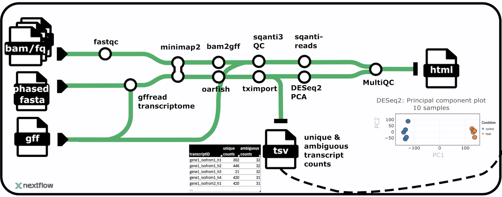

# longrnaseq



## Introduction

**longrnaseq** is a bioinformatics pipeline that processes long-read RNA sequencing data. The pipeline performs quality control, alignment, classification, contamination detection, and transcript quantification for long-read RNA-seq data from multiple samples.

The pipeline includes the following main steps:

1. Read QC ([`FastQC`](https://www.bioinformatics.babraham.ac.uk/projects/fastqc/))
2. Present QC for samples ([`MultiQC`](http://multiqc.info/))
3. Genome alignment ([`Minimap2`](https://github.com/lh3/minimap2))
4. Contamination detection ([`Centrifuge`](https://ccb.jhu.edu/software/centrifuge/))
5. Comparion of samples by transcript classification ([`SQANTI-reads`](https://github.com/ConesaLab/SQANTI3))
6. Transcript quantification ([`Oarfish`](https://github.com/COMBINE-lab/oarfish)) and gene-level summarization

## Dependencies

An environment with nextflow (>=24.04.2) and Singularity installed.

**Note:** If you want to run SQANTI-reads quality control, you will also need to:
- Install all [SQANTI3 dependencies](https://github.com/ConesaLab/SQANTI3/blob/master/SQANTI3.conda_env.yml) in the same environment as nextflow (sorry there is not functional singularity at the moment..)
- Clone the [SQANTI3 git repository](https://github.com/ConesaLab/SQANTI3) and provide the directory as input

For running Centrifuge, you also need to create a [Centrifuge database](https://ccb.jhu.edu/software/centrifuge/manual.shtml).


## Usage
First, prepare a samplesheet with your input data that looks as follows:

`samplesheet.csv`:

```csv
sample,fastq_1
SAMPLE1,sample1_R1.fastq.gz
SAMPLE2,sample2_R1.fastq.gz
```

Each row represents a sample with one fastq file.

## Running the Pipeline

### Required Parameters

The pipeline requires the following mandatory parameters:
- `--input`: Path to samplesheet CSV file
- `--outdir`: Output directory path
- `--fasta`: Path to reference genome FASTA file
- `--gtf`: Path to GTF annotation file (for BAMBU to get the right output with gene_id!)
- `--centrifuge_db`: Path to Centrifuge database
- `--sqanti_dir`: Path to SQANTI3 directory
- `--downsample_sqanti`: fraction between 0-1 for downsampling before running SQANTI3 to reduce runtime

*Note about gtf file*
gtf-version 3
should include features: gene, transcript, exon, CDS

### Profile Support

Currently, only the `singularity` profile is supported. Use `-profile singularity` in your command.

### Example Command

```bash
nextflow run main.nf -resume -profile singularity \
    --input samplesheet.csv \
    --outdir results \
    --fasta /path/to/genome.fa \
    --gtf /path/to/annotation.gtf \
    --centrifuge_db /path/to/centrifuge_db \
    --sqanti_dir /path/to/sqanti3 \
    --technology ONT/PacBio \
    --skip_sqanti
```
## Note at the moment sqanti-reads is not run so you don't need to specific an actucal sqanti_dir
### Optional Parameters

- `--skip_sqanti`: Skip sqanit and sqanti reads
- `-bg`: Run pipeline in background
- `-resume`: Resume previous run from where it left off

## Pipeline output

The main output is a MultiQC.html, SQANTI-reads output and oarfish transcript and gene counts.

## Credits

nf-core/plantlongrnaseq was originally written by Nadja Nolte.

We thank the following people for their extensive assistance in the development of this pipeline:

<!-- TODO nf-core: If applicable, make list of people who have also contributed -->

## Contributions and Support

If you would like to contribute to this pipeline, please get in touch nadja.franziska.nolte[at]nib.si

## Citations

<!-- TODO nf-core: Add citation for pipeline after first release. Uncomment lines below and update Zenodo doi and badge at the top of this file. -->
<!-- If you use nf-core/plantlongrnaseq for your analysis, please cite it using the following doi: [10.5281/zenodo.XXXXXX](https://doi.org/10.5281/zenodo.XXXXXX) -->

<!-- TODO nf-core: Add bibliography of tools and data used in your pipeline -->

An extensive list of references for the tools used by the pipeline can be found in the [`CITATIONS.md`](CITATIONS.md) file.

You can cite the `nf-core` publication as follows:

> **The nf-core framework for community-curated bioinformatics pipelines.**
>
> Philip Ewels, Alexander Peltzer, Sven Fillinger, Harshil Patel, Johannes Alneberg, Andreas Wilm, Maxime Ulysse Garcia, Paolo Di Tommaso & Sven Nahnsen.
>
> _Nat Biotechnol._ 2020 Feb 13. doi: [10.1038/s41587-020-0439-x](https://dx.doi.org/10.1038/s41587-020-0439-x).


